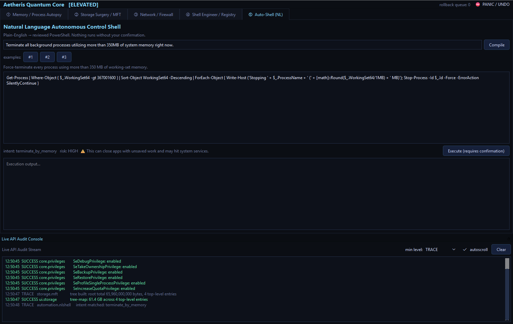

# Aetheris Quantum Core — Advanced Systems Instrumentation Suite

A unified, PyQt6 desktop workspace that merges process/memory forensics, raw
storage surgery, live network/firewall control, registry engineering, and a
natural-language automation shell into one dashboard. It targets power users,
security researchers, and systems administrators operating on machines they
control.

> **Status: working v0.1.** The full decoupled architecture, the safety shield,
> the live audit console, and functional cores for every module are in place and
> exercised by the test suite. Optional native engines (MemProcFS, capstone,
> keystone) degrade gracefully with an install hint when absent; the one
> optional data drop-in (a GeoLite2 DB for city-level GeoIP) is clearly labelled
> in *Feature status* below rather than pretending to be complete.

## Walkthrough


The five module workspaces, rendered from the real app (representative data
shown in place of live machine data):

| | |
|---|---|
|  **① Memory / Process Autopsy** — process table, ASLR/DEP/signature columns, live CPU/RAM chart, Assembly Studio, and the audit console. |  **② Storage / MFT** — squarified space-utilization tree-map with drill-down. |
|  **③ Network / Firewall** — socket→process table with GeoIP + per-process B/s columns, live throughput chart, "Nuke" isolation. |  **⑤ Auto-Shell** — plain-English → reviewed PowerShell with an intent/risk label and a mandatory confirm gate. |

Regenerate with `python docs/make_screenshots.py --gif`. For a live, auto-
cycling demo to screen-record, run `python docs/demo_mode.py`. The layered
design is documented in [`docs/ARCHITECTURE.md`](docs/ARCHITECTURE.md).

## Layout

```
aetheris/
├── core/          privileges, native bindings, log bus, Omega Rollback, registry, settings, reports
├── forensics/     process autopsy, RAM matrix, Capstone/Keystone assembly studio
├── storage/       raw MFT parser, SHA-256 dedupe / ghost scan, guarded obliterator
├── network/       socket→process interceptor, per-process B/s, GeoIP, firewall isolation
├── automation/    natural-language → reviewed PowerShell compiler
├── plugins/       built-in extension tools (top-memory, public-connections, …)
├── cli.py         headless forensic capture (`aetheris-cli`)
└── ui/            PyQt6 window, theme, log drawer, telemetry charts, module tabs
run.py             entry point + UAC elevation bootstrap
pyproject.toml     packaging + `aetheris` / `aetheris-cli` entry points
installer/         one-click installer, bootstrap, Inno Setup, exe build + signing
tests/             pytest suite (96 tests) for the cores
```

## Install & run

### Most turnkey — standalone one-file executable

Build a single `dist\AetherisQuantumCore.exe` with Python and all dependencies
frozen inside (nothing to install; the user just runs it):

```powershell
powershell -ExecutionPolicy Bypass -File installer\build_exe.ps1
```

### Easiest — one-click installer

Open `installer\` and double-click **`Install.bat`**. It ensures Python 3.10+
(installing it via winget / python.org if needed), copies the app to
`%LOCALAPPDATA%\Aetheris Quantum Core`, downloads **every dependency** into a
private virtual environment, and creates Start-menu + Desktop shortcuts. A
single-file `AetherisSetup.exe` can also be produced with Inno Setup. See
[`installer/README.md`](installer/README.md) for all three paths (one-click,
Inno Setup `.exe`, and pip).

### Developers — pip

```powershell
python -m venv .venv
.\.venv\Scripts\Activate.ps1
pip install .[full]                    # or .[recommended] to skip heavy wheels
aetheris                               # GUI entry point (or: python run.py)
```

`PyQt6` and `psutil` are required for the GUI. `pywin32`, `comtypes`,
`pyqtgraph`, `capstone`, `keystone-engine`, and `memprocfs` unlock additional
features and degrade gracefully when absent (the UI tells you what's missing).

### Tests

```powershell
pip install .[test]
pytest                                 # 96 tests over the cores
```

The suite (`tests/`) regression-guards the deterministic cores: Auto-Shell
intent routing, MFT run-list/fixup parsing + tree aggregation, treemap squarify
layout, registry diffing, dedupe, the memory hex formatter, per-process
bandwidth attribution math, GeoIP field extraction (plus a real GeoLite2 lookup
when a DB is present), the cascading-menu spec parser, the settings store and
report serializers, the committed app-icon structure, and (Windows-only) the ETW
sampler contract, the Restart-Manager lockers, and the live handle-strip
round-trip. GitHub Actions (`.github/workflows/ci.yml`) runs
it on Windows against Python 3.11 and 3.12 on every push/PR; a tag push runs
`release.yml`, which builds `AetherisQuantumCore.exe`, **headlessly smoke-launches
it**, compiles `AetherisSetup.exe`, and attaches both to a GitHub Release.

## Trust & safety model (read this)

This suite is built to be **auditable and reversible**, not stealthy:

- **Privileges.** It uses standard UAC elevation and enables a small, named set
  of privileges (`SeDebugPrivilege`, `SeTakeOwnership`, `SeBackup/Restore`,
  …) on its *own* process. It deliberately does **not** clone other processes'
  tokens to impersonate `SYSTEM`/`TrustedInstaller`, and does not run a hidden
  background daemon. Elevated admin + `SeDebugPrivilege` is all the inspection
  features need.
- **Omega Rollback.** Reversible operations (firewall rules, registry writes,
  service changes, context-menu edits) register an undo with a session ledger.
  The **PANIC** button (toolbar, or `Ctrl+Shift+Esc`) reverts them in reverse
  order. `core/safety.py` also creates a System Restore point and can snapshot a
  registry key to a hive file before deep changes.
- **Confirmation gates.** Memory patching, process termination, file
  obliteration, and every generated automation script require an explicit modal
  confirmation before executing.
- **Guardrails in code.** The file obliterator refuses paths inside protected OS
  roots and refuses to close handles held by / terminate system-critical
  processes — enforced in `storage/unlock.py`, not just the UI.
- **Audit console.** Every native transaction, allocation address, handle op,
  and destructive action streams to the bottom drawer with return codes and a
  human-readable translation.

The suite does **not** include a credential-extraction path against
`HKLM\SAM` / `HKLM\SECURITY`; the registry tools operate on ordinary hives.

## Reports, persistence & signing

- **Export** — the toolbar's *Export report* writes a self-contained HTML (or
  Markdown) session report (system summary + top processes + active connections).
  The Memory and Network tabs export their tables as CSV/JSON, and the registry
  differ exports its Markdown/HTML diff.
- **Persistence** — window geometry, active tab, log verbosity/autoscroll, the
  DNS-resolve toggle, and the MFT inputs persist across sessions in
  `%APPDATA%\AetherisQuantumCore\settings.json` (atomic writes, defaults on any
  corrupt/missing file).
- **Code signing** — the exe/installer are Authenticode-signable; the build
  script and release workflow sign when a certificate is configured and produce
  working unsigned binaries otherwise. See [`docs/SIGNING.md`](docs/SIGNING.md).

## Plugins & headless CLI

- **Plugins** — drop a `*.py` in `%APPDATA%\AetherisQuantumCore\plugins` that
  exposes a `PLUGIN`. Two kinds: **text** tools (over live process/connection
  snapshots — run in the GUI *and* headlessly) and **widget** tools (return a
  live QWidget, GUI-only). Built-ins: top-memory, public-connections,
  listening-ports, and a live-gauges widget. They appear in the **⚙ Plugins**
  tab.
- **Scheduled capture** — the toolbar **⏱ Schedule…** registers a Windows
  scheduled task (per-user, no admin) that runs `aetheris-cli` to write a report
  on an interval; create/remove/inspect from the dialog.
- **CLI** — `aetheris-cli` dumps reports without the GUI (great for Task
  Scheduler / cron):

  ```powershell
  aetheris-cli report --format html --out session.html
  aetheris-cli connections --format csv --out conns.csv
  aetheris-cli run public-connections
  aetheris-cli report --out s.html --interval 300 --count 12   # scheduled capture
  ```

- **Registry diff viewer** — the Shell tab shows a color-coded, filterable
  Added/Modified/Removed table (not just Markdown), can save/load snapshots as
  JSON, and **auto-saves timestamped snapshots to a history** you can reload as
  the "before" side for point-in-time diffing.

## Auto-update

The frozen exe can update itself. Host a small `version.json` manifest (any
https URL, or a synced-folder `file://` path) plus the new exe:

```json
{ "version": "0.1.1",
  "url": "https://your-host/AetherisQuantumCore.exe",
  "notes": "what changed",
  "sha256": "optional-hex-digest" }
```

This build ships with `update_url` defaulting to **`github:Dray973/Aetheris`** —
so fresh installs auto-check that repo's GitHub Releases. To turn it on:

1. Create a **public** GitHub repo named `Aetheris` under your account and push
   this project to it.
2. Bump `aetheris/__init__.py` `__version__`, commit, then tag + push:
   `git tag v0.1.1 && git push --tags`.
3. CI (`release.yml`) builds `AetherisQuantumCore.exe` + `version.json` and
   attaches them to the Release. Every client updates itself on next launch.

(The repo must be **public** — the updater calls the GitHub API with no auth.)

You can change the source any time via the toolbar **⟳ Updates** button (or the
`update_url` setting). Two source types:

- **GitHub Releases** (easiest — CI already publishes them):
  `update_url = github:your-user/your-repo`. The app reads that repo's latest
  release, compares the tag, and grabs the `AetherisQuantumCore.exe` asset.
- **A hosted manifest**: any `https://` or synced-folder `file://` path to a
  `version.json` like above.

On startup it checks in the background; if a newer version is found it downloads
it and **applies it on the next launch** (swaps the exe and relaunches). Optional
`sha256` is verified before staging. Dev/pip installs report that updates are
managed by git/pip instead.

**Producing releases:** `installer\build_all.ps1 -BaseUrl https://your-host`
writes `dist\version.json` (version + sha256 + download URL) next to the exe —
upload both. Or just push a git tag: `release.yml` builds the exe, generates
`version.json` pointing at the repo's stable `releases/latest/download/` URL, and
attaches everything to the GitHub Release automatically.

## Feature status

| Module | Shipped & functional | Environment-gated / optional |
|---|---|---|
| ① Memory/Process | psutil autopsy, mitigation query, working-set trim, standby purge, file-cache flush, Capstone disasm of live memory, Keystone patch, **Virtual Memory Scanner** (backend-driven: live `VirtualQueryEx` region maps + `ReadProcessMemory` hex view now; **MemProcFS** physical-RAM virtualization, hidden-process & physical reads when the lib + acquisition driver are present), **live CPU/RAM telemetry chart (pyqtgraph)** | — |
| ② Storage/MFT | NTFS binary parse w/ **full $MFT run-list walk** (fragmented MFTs), fixups, **directory-tree reconstruction + squarified tree-map canvas** (drill-down), SHA-256 dedupe, ghost scan, guarded obliterator, **Restart-Manager lockers + raw handle stripping** (`NtQuerySystemInformation` handle table → `DuplicateHandle(DUPLICATE_CLOSE_SOURCE)`, timeout-guarded name queries) | — |
| ③ Network | socket→process map, system bandwidth, **live throughput chart (pyqtgraph)**, INetFwPolicy2 isolate/deisolate w/ rollback, **live per-process TCP B/s via ETW** (native `Microsoft-Windows-Kernel-Network` consumer — verified attributing bytes to the owning PID; IP-Helper EStats kept as a fallback), **offline IP geolocation** (geoip2 + GeoLite2 `.mmdb`; verified end-to-end against a real DB — `81.2.69.160 → GB · London`; one-command enable via `docs/fetch_geoip.py`) | — |
| ④ Shell/Registry | Regshot-style snapshot diff (Markdown/structured/history), reversible privacy toggles, DiagTrack disable, context-menu editor, **multi-level cascading submenu builder**, **Autoruns manager** (Run/RunOnce + Startup folders; reversible enable/disable) | — |
| ⑤ Auto-Shell | deterministic NL→PowerShell: find/move, kill-by-memory, kill-by-name, CPU affinity, flush DNS, empty recycle bin, clear temp, restart service, largest-files — all behind a confirm gate + a refusal guard for "kill all processes"-style inputs | still deterministic (no LLM) by design |

Environment-gated items report their status in the UI (e.g. the per-process
bandwidth line shows why EStats is unavailable) or print an "install X" hint
rather than silently doing nothing.

## Development

```powershell
python -m py_compile (Get-ChildItem -Recurse -Filter *.py aetheris | % FullName)
python -c "import aetheris.core.nlshell_smoke" 2>$null   # see tools below
```

Non-Windows machines can import and unit-test the pure-Python layers (nlshell,
dedupe, registry diff logic); Win32-specific calls guard on `sys.platform`.
