# Aetheris Quantum Core — Advanced Systems Instrumentation Suite

A unified, PyQt6 desktop workspace that merges process/memory forensics, raw
storage surgery, live network/firewall control, registry engineering, and a
natural-language automation shell into one dashboard. It targets power users,
security researchers, and systems administrators operating on machines they
control.

> **Status: v0.1.9.** A strictly decoupled architecture, a persistent
> tamper-evident (hash-chained) audit log, a global **dry-run** rehearsal mode,
> and the Omega-Rollback safety shield back every module. The dozen modules are
> reached from a single compact **dropdown navigator**. Recent additions: a
> **Service & Driver Inspector** (with an unquoted-service-path privesc finder),
> a **Scheduled-Task auditor**, a unified **Startup / Persistence Map**, a
> session **Timeline / state-diff**, real **Authenticode** verification, a
> **Plugin API v2** (declared permissions + a hash trust-list), a scrubbed
> **crash reporter**, a live process **Debugger** (attach · breakpoints · registers),
> a PCILeech **DMA** physical-memory workspace, a cross-module **Threat-Hunt**
> engine that correlates everything into ranked, **MITRE ATT&CK**-tagged findings,
> an in-process **API Monitor** (inject a native agent to watch a target's Win32
> calls), and a built-in **auto-updater** that self-updates *in place* — the standalone
> exe swaps itself, and a source/venv install now downloads + mirrors the new
> source over itself (refreshing the `.venv` with pip when dependencies change),
> no installer re-run required.
> Every write is confirm-gated, reversible via PANIC, audited,
> and dry-run-aware; long/native work runs off the UI thread. The pure layers
> pass `mypy --strict` + `ruff` and are covered by 245 tests. Optional native
> engines (MemProcFS, capstone, keystone) degrade gracefully; the one optional
> data drop-in (a GeoLite2 DB for city-level GeoIP) is labelled in *Feature
> status* below rather than pretending to be complete.

## Walkthrough

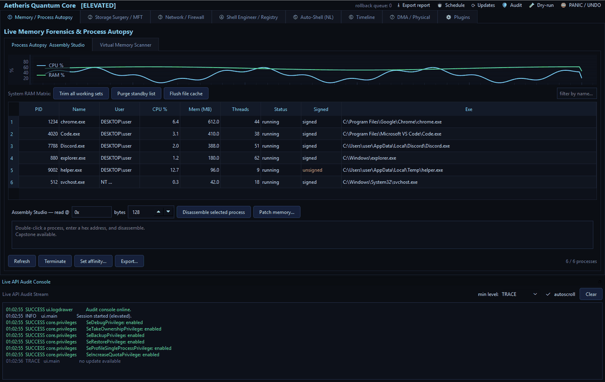

The module workspaces, rendered from the real app (representative data shown in
place of live machine data):

| | |
|---|---|
| 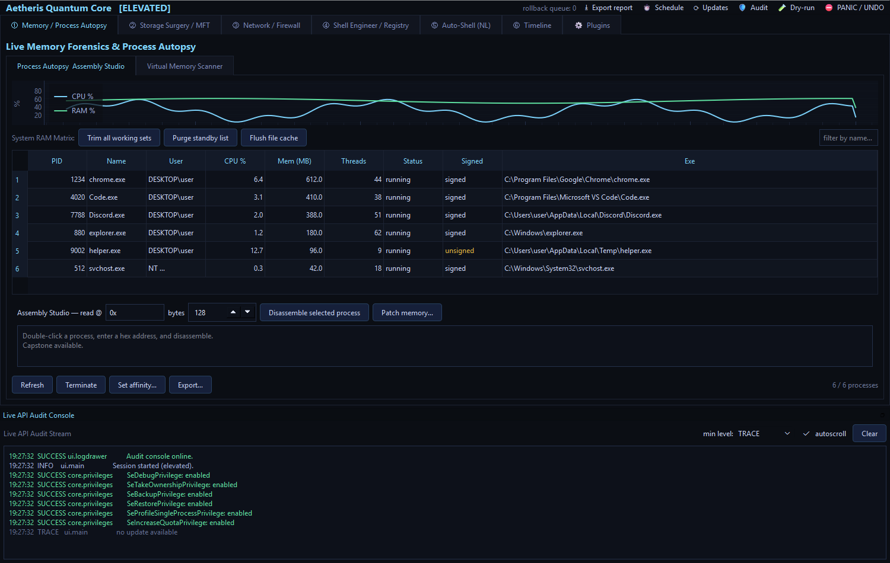 **① Memory / Process Autopsy** — process table with a live Authenticode **Signed** column (unsigned in amber), CPU/RAM chart, Assembly Studio, and the audit console. | 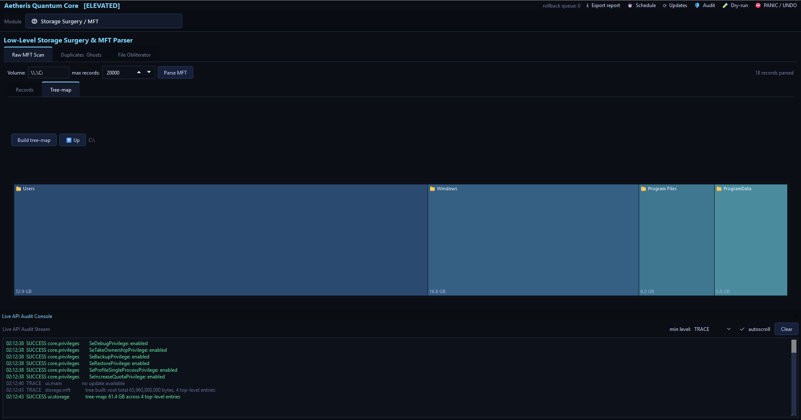 **② Storage / MFT** — squarified space-utilization tree-map with drill-down. |
| 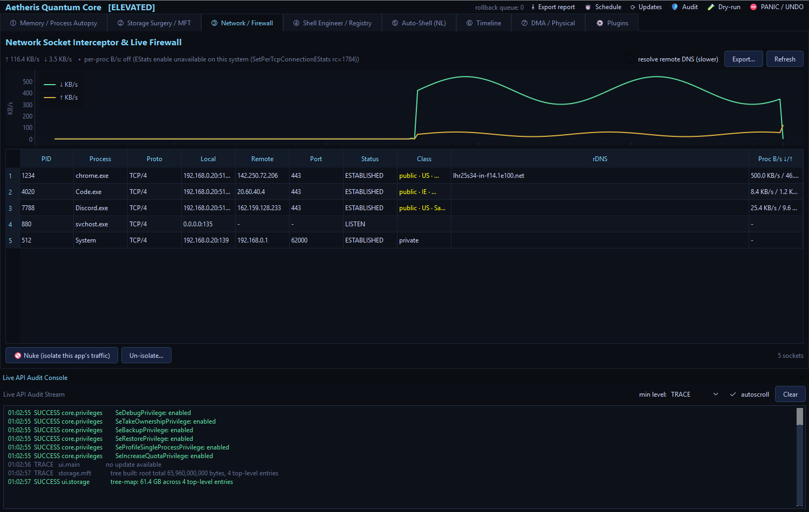 **③ Network / Firewall** — socket→process table with GeoIP + per-process B/s columns, live throughput chart, "Nuke" isolation. | 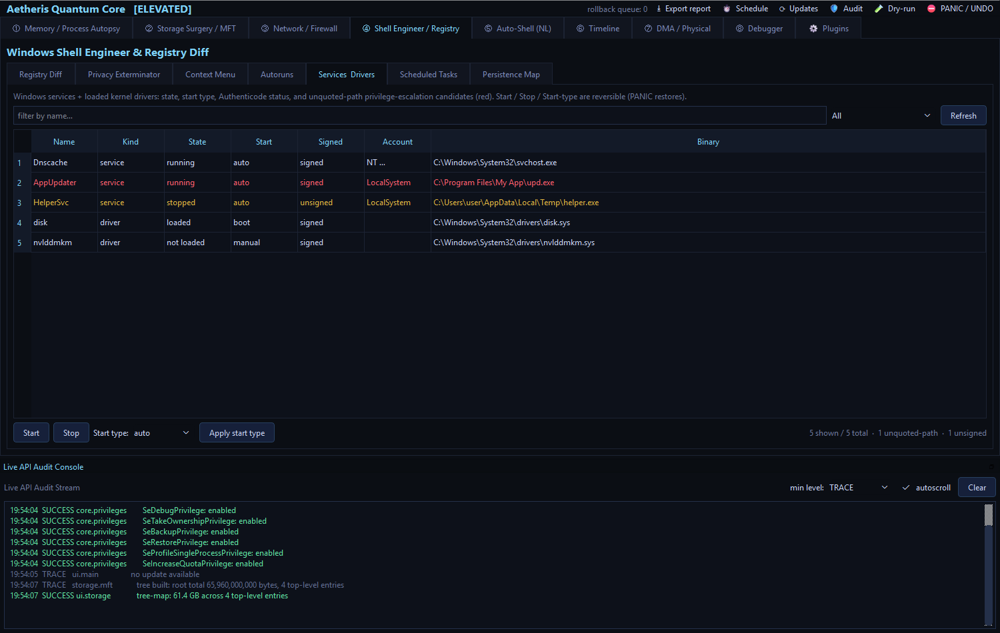 **④ Service & Driver Inspector** — services + kernel drivers with signed/loaded status and **unquoted-service-path** privesc candidates (red); reversible start/stop/start-type. |
| 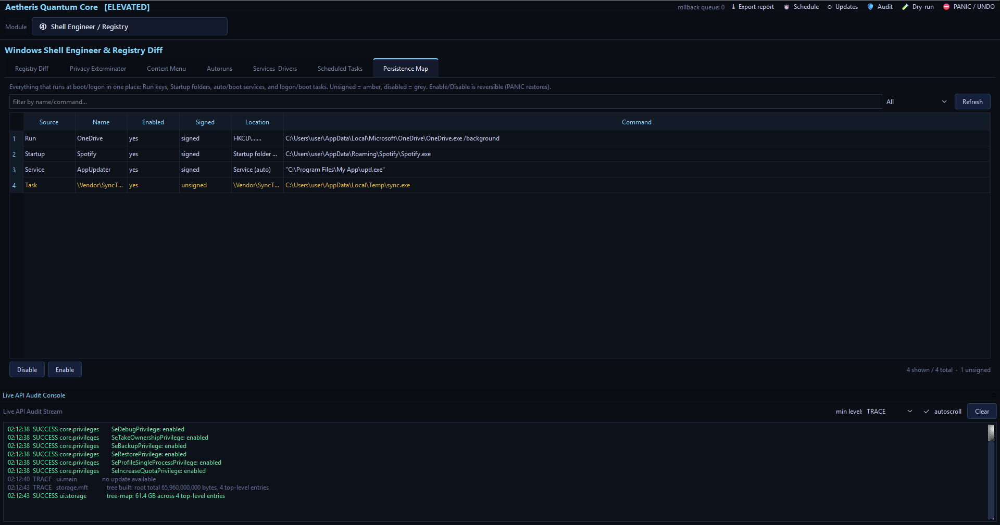 **⑤ Persistence Map** — one screen unifying Run/Startup + auto/boot services + logon/boot tasks; reversible enable/disable. | 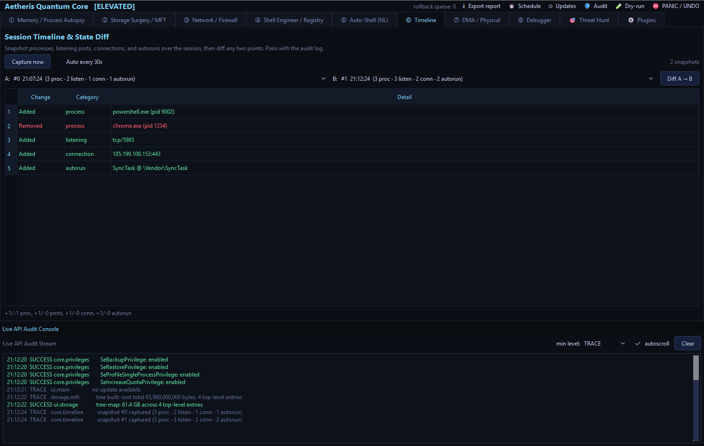 **⑥ Session Timeline** — periodic state snapshots; diff *any two* points (processes/ports/connections/autoruns added·removed). |
| 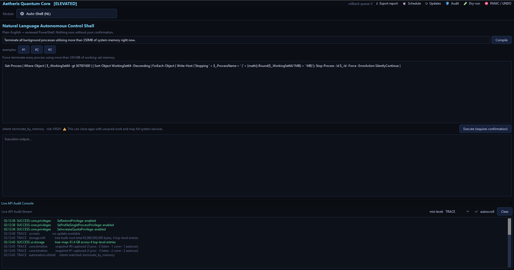 **⑦ Auto-Shell** — plain-English → reviewed PowerShell with an intent/risk label and a mandatory confirm gate. | 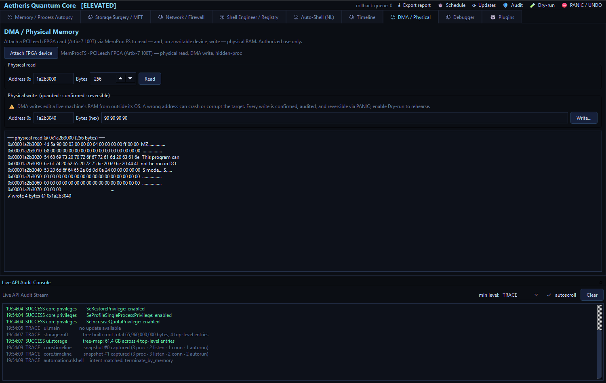 **⑧ DMA / Physical** — PCILeech **FPGA** (Artix-7 100T) physical-memory read + a **guarded DMA write** (dry-run, audited, PANIC-reversible) over MemProcFS; controls stay disabled until a writable device is attached. |
| 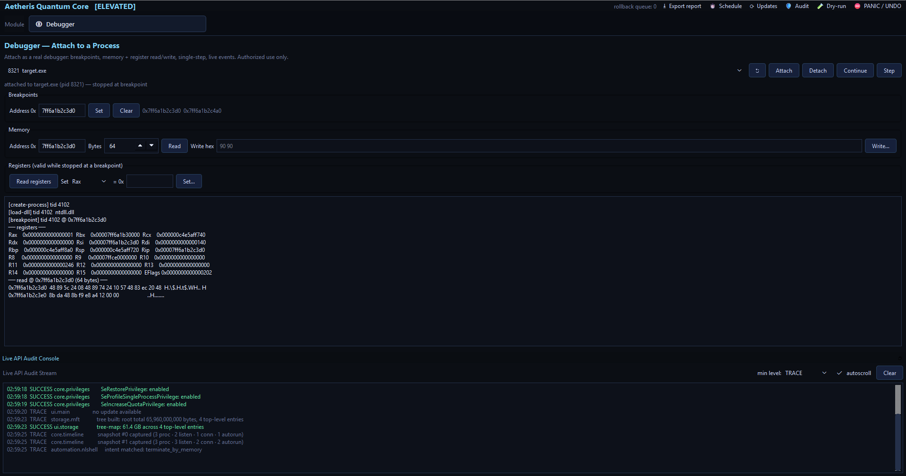 **⑨ Debugger** — attach to a running process as a real debugger: software **breakpoints**, memory + x64 **register** read/write, single-step, live debug events; attach + writes confirmed, dry-run-aware, PANIC-reversible. | 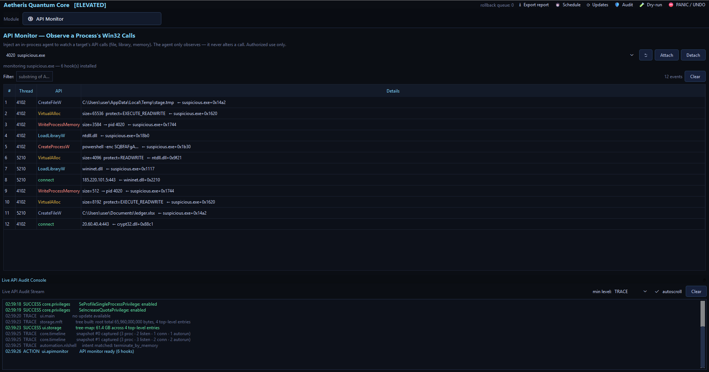 **⑩ API Monitor** — inject a native in-process agent to **observe** a target's Win32 calls (file / library / memory: CreateFileW · LoadLibraryW · VirtualAlloc · WriteProcessMemory) streamed live; the agent only watches — it never alters a call. Confirm-gated, audited, refuses system-critical processes. |
| 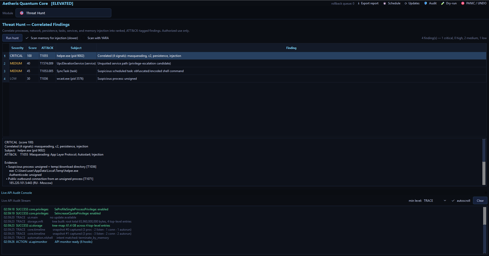 **🎯 Threat Hunt** — correlate processes, network, persistence, tasks, services + memory injection into ranked, **MITRE ATT&CK**-tagged findings; the same binary showing up as unsigned + temp + public-C2 + persistence collapses into one **critical** finding with evidence and reversible responses. | 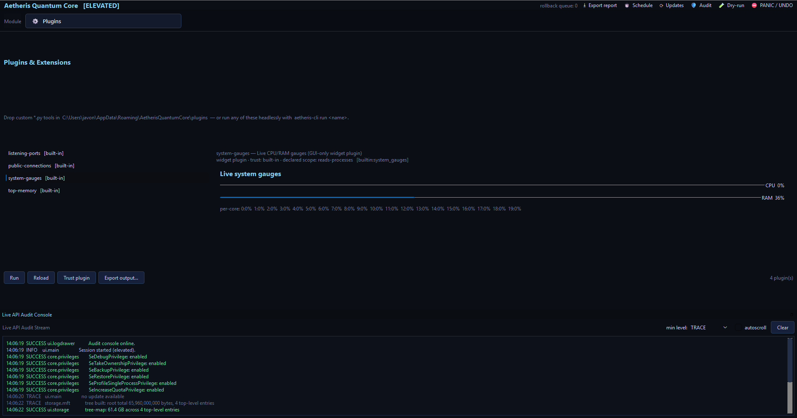 **⚙ Plugins v2** — text + widget tools with a declared **permission scope** and a hash **trust** state; untrusted runs are gated. |

Regenerate with `python docs/make_screenshots.py --gif`. For a live, auto-
cycling demo to screen-record, run `python docs/demo_mode.py`. The layered
design is documented in [`docs/ARCHITECTURE.md`](docs/ARCHITECTURE.md).

## Layout

```
aetheris/
├── core/          privileges, native bindings, Authenticode signing, hash-chained audit,
│                  dry-run, Omega Rollback, registry, services, taskaudit, persistence,
│                  timeline, plugins, scheduler, settings, reports, crash reporter
├── forensics/     process autopsy (+ signature), RAM matrix, Capstone/Keystone studio,
│                  PCILeech-FPGA physical read + guarded DMA write (memvirt/dma),
│                  live debugger — attach + breakpoints + registers (debugger),
│                  in-memory injection scan — RWX / unbacked-exec / private-PE (injection),
│                  optional YARA scanning of process memory + files (yarascan),
│                  in-process API monitor — host side of the injected agent (apimonitor),
│                  native entropy + byte-pattern scan with a pure-Python fallback (nativescan)
├── analysis/      threat-hunt findings engine — correlate every module into ranked,
│                  ATT&CK-tagged findings (findings)
├── storage/       raw MFT parser, SHA-256 dedupe / ghost scan, guarded obliterator, handle strip
├── network/       socket→process interceptor, per-process B/s (ETW), GeoIP, firewall isolation
├── automation/    natural-language → reviewed PowerShell compiler
├── plugins/       built-in extension tools (top-memory, public-connections, …) + permissions
├── cli.py         headless forensic capture (`aetheris-cli`, also `<exe> cli …`)
└── ui/            PyQt6 window, theme, dropdown module navigator (tabdeck), log drawer, module tabs
agent/             native C++ API-monitor agent DLL (injected) + its build script
native/            native Rust scan lib (entropy + memmem, cdylib) + its build script
run.py             entry point + UAC elevation bootstrap + headless CLI dispatch
pyproject.toml     packaging + `aetheris` / `aetheris-cli` entry points; ruff + mypy --strict
installer/         one-click installer, bootstrap, Inno Setup, exe build + signing
tests/             pytest suite (245 tests) for the cores + pytest-qt UI-thread tests
```

## Install & run

### Most turnkey — standalone one-file executable

Build a single `dist\AetherisQuantumCore.exe` with Python and all dependencies
frozen inside (nothing to install; the user just runs it):

```powershell
powershell -ExecutionPolicy Bypass -File installer\build_exe.ps1
```

### Easiest — one-click installer

Open `installer\` and double-click **`Install.bat`**. It ensures Python 3.10+
(installing it via winget / python.org if needed), copies the app to
`%LOCALAPPDATA%\Aetheris Quantum Core`, downloads **every dependency** into a
private virtual environment, and creates Start-menu + Desktop shortcuts. A
single-file `AetherisSetup.exe` can also be produced with Inno Setup. See
[`installer/README.md`](installer/README.md) for all three paths (one-click,
Inno Setup `.exe`, and pip).

### Developers — pip

```powershell
python -m venv .venv
.\.venv\Scripts\Activate.ps1
pip install .[full]                    # or .[recommended] to skip heavy wheels
aetheris                               # GUI entry point (or: python run.py)
```

`PyQt6` and `psutil` are required for the GUI. `pywin32`, `comtypes`,
`pyqtgraph`, `capstone`, `keystone-engine`, `memprocfs`, and `yara-python` unlock
additional features and degrade gracefully when absent (the UI tells you what's missing).

### Tests

```powershell
pip install .[test]
pytest                                 # 245 tests over the cores
```

The suite (`tests/`) regression-guards the deterministic cores: Auto-Shell
intent routing, MFT run-list/fixup parsing + fragmented-$MFT walk + tree
aggregation (plus a **hypothesis fuzz** of the binary parser against malformed
run-lists/records), the **Qt-free** treemap squarify layout (imports and runs
with no PyQt6 installed), registry diffing, dedupe, the memory hex formatter,
per-process bandwidth attribution math, GeoIP field extraction (plus a real
GeoLite2 lookup when a DB is present), the cascading-menu spec parser, the
settings store and report serializers, the **tamper-evident hash-chained audit
log** (+ file persistence and tamper detection), **global dry-run** enforcement
across terminate / Auto-Shell / registry / firewall / obliterate, the
**Omega-Rollback PANIC round-trip**, the **service / task / persistence** models
(unquoted-path detector, task suspicion heuristics, reversible-toggle dispatch),
the **timeline state-diff**, **plugin permissions + trust lifecycle**, the crash
reporter's scrubbing, and the obliterator guardrail; plus **pytest-qt** UI-thread
tests that prove blocking native calls run off the event loop. Windows-only tests
cover Authenticode signing (WinVerifyTrust + catalog), the ETW sampler **and its
TcpIp opcode/payload attribution** (synthetic-record injection), the shared-handle
restypes, the Restart-Manager lockers, and the live handle-strip round-trip.
GitHub Actions (`.github/workflows/ci.yml`) runs
it on Windows against Python 3.11 and 3.12 on every push/PR; a tag push runs
`release.yml`, which builds `AetherisQuantumCore.exe`, **headlessly smoke-launches
it**, compiles `AetherisSetup.exe`, and attaches both to a GitHub Release.

## Trust & safety model (read this)

This suite is built to be **auditable and reversible**, not stealthy:

- **Privileges.** It uses standard UAC elevation and enables a small, named set
  of privileges (`SeDebugPrivilege`, `SeTakeOwnership`, `SeBackup/Restore`,
  …) on its *own* process. It deliberately does **not** clone other processes'
  tokens to impersonate `SYSTEM`/`TrustedInstaller`, and does not run a hidden
  background daemon. Elevated admin + `SeDebugPrivilege` is all the inspection
  features need.
- **Omega Rollback.** Reversible operations (firewall rules, registry writes,
  service changes, context-menu edits) register an undo with a session ledger.
  The **PANIC** button (toolbar, or `Ctrl+Shift+Esc`) reverts them in reverse
  (LIFO) order, isolating any failing undo so the rest still run — a property the
  test suite proves end-to-end for a real registry op. `core/safety.py` also
  creates a System Restore point and can snapshot a registry key to a hive file
  before deep changes.
- **Dry-run mode.** A global **🧪 Dry-run** toggle (toolbar) makes every opted-in
  destructive op — firewall isolation, registry writes, autorun disables, file
  obliteration — log exactly what it *would* do to the audit console and return
  without touching the system or registering an undo, so you can rehearse a
  sequence before arming it (`core/dryrun.py`).
- **Confirmation gates.** Memory patching, process termination, file
  obliteration, and every generated automation script require an explicit modal
  confirmation before executing.
- **Guardrails in code.** The file obliterator refuses paths inside protected OS
  roots and refuses to close handles held by / terminate system-critical
  processes — enforced in `storage/unlock.py`, not just the UI.
- **Tamper-evident audit console.** Every native transaction, allocation
  address, handle op, and destructive action streams to the bottom drawer with
  return codes and a human-readable translation — and each event is linked into
  a **SHA-256 hash chain** (`core/audit.py`), so any later edit, deletion, or
  reorder of the trail is detectable. The chain is also **persisted** to
  `%APPDATA%\AetherisQuantumCore\audit\session-<ts>.jsonl` (on by default) so a
  forensic record survives the app closing; the toolbar **🛡 Audit** button
  re-verifies the chain on demand, and `verify_audit_log()` re-checks a file.
- **Crash reporter.** An unhandled exception writes a **scrubbed** crash file to
  `%APPDATA%\…\crashes\` — the error + traceback only (no memory or process
  data), with the home path and account name redacted so it's safe to share.

The suite does **not** include a credential-extraction path against
`HKLM\SAM` / `HKLM\SECURITY`; the registry tools operate on ordinary hives.

## Reports, persistence & signing

- **Export** — the toolbar's *Export report* writes a self-contained HTML (or
  Markdown) session report (system summary + top processes + active connections).
  The Memory and Network tabs export their tables as CSV/JSON, and the registry
  differ exports its Markdown/HTML diff.
- **Persistence** — window geometry, active tab, log verbosity/autoscroll, the
  DNS-resolve toggle, and the MFT inputs persist across sessions in
  `%APPDATA%\AetherisQuantumCore\settings.json` (atomic writes, defaults on any
  corrupt/missing file).
- **Code signing** — the exe/installer are Authenticode-signable; the build
  script and release workflow sign when a certificate is configured and produce
  working unsigned binaries otherwise. See [`docs/SIGNING.md`](docs/SIGNING.md).

## Plugins & headless CLI

- **Plugins (v2)** — drop a `*.py` in `%APPDATA%\AetherisQuantumCore\plugins`
  that exposes a `PLUGIN` (and, optionally, a `PERMISSIONS` list). Two kinds:
  **text** tools (over live process/connection snapshots — run in the GUI *and*
  headlessly) and **widget** tools (return a live QWidget, GUI-only). The gallery
  shows each plugin's **declared permission scope** and a **trust** state — built
  in, or (for user plugins) untrusted → trusted (once you record its hash) →
  modified (tamper-evident if the file later changes); running an untrusted or
  modified plugin is confirm-gated. This is **disclosure + provenance, not a
  sandbox** — Python can't contain a plugin, so the gate discloses scope rather
  than restricting it. Built-ins: top-memory, public-connections,
  listening-ports, and a live-gauges widget. They appear in the **⚙ Plugins**
  tab.
- **Scheduled capture** — the toolbar **⏱ Schedule…** registers a Windows
  scheduled task (per-user, no admin) that runs `aetheris-cli` to write a report
  on an interval; create/remove/inspect from the dialog.
- **CLI** — `aetheris-cli` dumps reports without the GUI (great for Task
  Scheduler / cron):

  ```powershell
  aetheris-cli report --format html --out session.html
  aetheris-cli connections --format csv --out conns.csv
  aetheris-cli run public-connections
  aetheris-cli report --out s.html --interval 300 --count 12   # scheduled capture
  ```

- **Registry diff viewer** — the Shell tab shows a color-coded, filterable
  Added/Modified/Removed table (not just Markdown), can save/load snapshots as
  JSON, and **auto-saves timestamped snapshots to a history** you can reload as
  the "before" side for point-in-time diffing.

## Auto-update

The frozen exe can update itself. Host a small `version.json` manifest (any
https URL, or a synced-folder `file://` path) plus the new exe:

```json
{ "version": "0.1.1",
  "url": "https://your-host/AetherisQuantumCore.exe",
  "notes": "what changed",
  "sha256": "optional-hex-digest" }
```

This build ships with `update_url` defaulting to **`github:Dray973/Aetheris`** —
so fresh installs auto-check that repo's GitHub Releases. To turn it on:

1. Create a **public** GitHub repo named `Aetheris` under your account and push
   this project to it.
2. Bump `aetheris/__init__.py` `__version__`, commit, then tag + push:
   `git tag v0.1.1 && git push --tags`.
3. CI (`release.yml`) builds `AetherisQuantumCore.exe` + `version.json` and
   attaches them to the Release. Every client updates itself on next launch.

(The repo must be **public** — the updater calls the GitHub API with no auth.)

You can change the source any time via the toolbar **⟳ Updates** button (or the
`update_url` setting). Two source types:

- **GitHub Releases** (easiest — CI already publishes them):
  `update_url = github:your-user/your-repo`. The app reads that repo's latest
  release, compares the tag, and grabs the `AetherisQuantumCore.exe` asset.
- **A hosted manifest**: any `https://` or synced-folder `file://` path to a
  `version.json` like above.

On startup it checks in the background; if a newer version is found it downloads
it and **applies it on the next launch** (swaps the exe and relaunches). Optional
`sha256` is verified before staging. Dev/pip installs report that updates are
managed by git/pip instead.

**Producing releases:** `installer\build_all.ps1 -BaseUrl https://your-host`
writes `dist\version.json` (version + sha256 + download URL) next to the exe —
upload both. Or just push a git tag: `release.yml` builds the exe, generates
`version.json` pointing at the repo's stable `releases/latest/download/` URL, and
attaches everything to the GitHub Release automatically.

## Feature status

| Module | Shipped & functional | Environment-gated / optional |
|---|---|---|
| ① Memory/Process | psutil autopsy, **Authenticode signature check** (WinVerifyTrust + catalog, cached), ASLR/DEP mitigation query (ASLR live; DEP is x64-permanent so it reports only for 32-bit procs), working-set trim, standby purge, file-cache flush, Capstone disasm of live memory, Keystone patch, **Virtual Memory Scanner** (live `VirtualQueryEx` region maps + `ReadProcessMemory` hex view), **live CPU/RAM telemetry chart (pyqtgraph)** | **MemProcFS** physical-RAM virtualization / hidden-process & physical reads — needs the `memprocfs` lib **and** an acquisition driver; not exercised by CI |
| ② Storage/MFT | NTFS binary parse w/ **full $MFT run-list walk** (fragmented MFTs), fixups, **directory-tree reconstruction + squarified tree-map canvas** (drill-down), SHA-256 dedupe, ghost scan, guarded obliterator, **Restart-Manager lockers + raw handle stripping** (`NtQuerySystemInformation` handle table → `DuplicateHandle(DUPLICATE_CLOSE_SOURCE)`, timeout-guarded name queries) | — |
| ③ Network | socket→process map, system bandwidth, **live throughput chart (pyqtgraph)**, INetFwPolicy2 isolate/deisolate w/ rollback, **offline IP geolocation** (geoip2 + GeoLite2 `.mmdb`; field extraction is unit-tested, and an opt-in test performs a real-DB lookup — `81.2.69.160 → GB · London` — when a GeoLite2 DB is present; one-command enable via `docs/fetch_geoip.py`) | **live per-process TCP B/s via ETW** — a real-time kernel **SystemTraceProvider** session (`NETWORK_TCPIP`) consuming classic `TcpIp` send/recv events and attributing bytes to the owning PID. CI verifies the sampler lifecycle, graceful degradation without elevation, the x64 struct ABI, and — via synthetic-record injection — the send/recv-**opcode** routing + `(PID, size)` payload parse; a live smoke test verifies real end-to-end attribution when elevated with external NIC traffic (skips cleanly otherwise). Requires an elevated token; IP-Helper EStats kept as a fallback |
| ④ Shell/Registry | Regshot-style snapshot diff (Markdown/structured/history), reversible privacy toggles, DiagTrack disable, context-menu editor, **multi-level cascading submenu builder**, **Autoruns manager**, **Service & Driver Inspector** (signed/loaded status + an **unquoted-service-path** privesc finder; reversible start/stop/start-type), **Scheduled-Task auditor** (temp-dir/unsigned/encoded-shell/logon-persistence flags + Markdown export), **Startup / Persistence Map** (Run/Startup + auto/boot services + logon/boot tasks unified; reversible enable/disable) | — |
| ⑤ Auto-Shell | deterministic NL→PowerShell: find/move, kill-by-memory, kill-by-name, CPU affinity, flush DNS, empty recycle bin, clear temp, restart service, largest-files — all behind a confirm gate + a refusal guard for "kill all processes"-style inputs | still deterministic (no LLM) by design |
| ⑥ Timeline | periodic lightweight snapshots (processes, listening ports, connections, autoruns); **diff any two points** in the session (added·removed), registry-diff-style table; pairs with the persistent audit log | — |
| ⑦ DMA / Physical | **guarded DMA-write pipeline** — dry-run rehearsal, a before-bytes snapshot, tamper-evident audit, and PANIC-reversible rollback, behind a confirm-gated UI whose read/write controls stay disabled until a *writable* device attaches; the write / rollback / dry-run / read-only-refusal paths are unit-tested against a fake backend | **PCILeech FPGA physical read + write** (Artix-7 **100T** and similar) over **MemProcFS/LeechCore** — needs the `memprocfs` lib, the LeechCore/FTDI drivers, the card's PCILeech firmware, and an elevated token; not exercised by CI |
| ⑧ Debugger | **live debugger** attach (`DebugActiveProcess` + SeDebugPrivilege): software breakpoints, memory + x64 register read/write, single-step, and a debug-event loop (DLL loads / exceptions / output). Attach + writes are confirmed, dry-run-aware, audited and PANIC-reversible; system-critical processes are refused; clean detach leaves the target running. The pure core (breakpoint save/restore, event decoding, RIP fix-up, trap-flag math) is unit-tested, and the native attach → breakpoint-hit → register-read → re-arm → detach loop was verified live against a self-spawned target (9/9) | needs a token that can debug the target (SeDebugPrivilege for other-user/elevated processes); refuses `lsass`/`csrss`/… |
| 🎯 Threat Hunt | **cross-module correlation engine** (`analysis/findings.py`): pulls process autopsy (+ Authenticode), connections (+ GeoIP), the persistence map, scheduled tasks, services, an in-memory **injection scan** (RWX / unbacked-exec / private-PE, `forensics/injection.py`), and optional **YARA** matching of suspect process memory + files (built-in + user rules, `forensics/yarascan.py`) into a single **ranked** list of findings — each tagged with a **MITRE ATT&CK** technique and reversible responses. The correlation is the point: signals about the same binary merge into one high-severity finding. Detectors + injection classifier + YARA mapping + the merge are pure and unit-tested; verified live on a real machine | injection/YARA scans need an elevated token to open other processes; YARA needs `yara-python` (degrades gracefully); heuristic (flags candidates, not verdicts) |
| ⚙ Plugins v2 | text + widget tools (built-in + user `*.py`), runnable in-app and via `aetheris-cli`; each declares a **permission scope** and carries a **trust** state (built-in / trusted / modified / untrusted, via a hash trust-list); untrusted runs are confirm-gated — **disclosure + provenance, not a sandbox** | — |

Environment-gated items report their status in the UI (e.g. the per-process
bandwidth line shows why EStats is unavailable) or print an "install X" hint
rather than silently doing nothing.

## Development

```powershell
python -m py_compile (Get-ChildItem -Recurse -Filter *.py aetheris | % FullName)
python -c "import aetheris.core.nlshell_smoke" 2>$null   # see tools below
```

Non-Windows machines can import and unit-test the pure-Python layers (nlshell,
dedupe, registry diff logic); Win32-specific calls guard on `sys.platform`.

## Contributors

- **[Dray973](https://github.com/Dray973)** — author & maintainer
- **Claude** (Anthropic) — pair-programming on features, code review, and fixes
