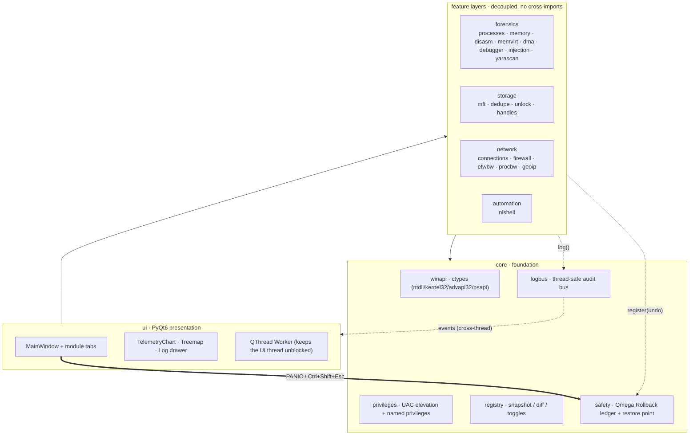
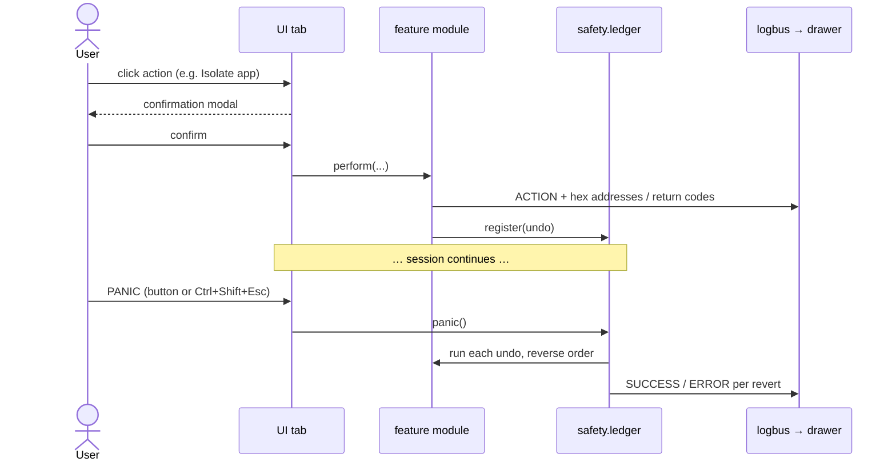

# Architecture

Aetheris is built as **strictly decoupled layers**: the UI depends on the
feature layers, the feature layers depend on `core`, and nothing depends
upward. Two `core` services — the **log bus** and the **Omega Rollback ledger** —
are cross-cutting: every layer publishes to them, and the UI subscribes.

## Layering

Because the feature layers never import each other or the UI, each is unit-
testable in isolation, and the pure-Python cores (MFT parsing, treemap layout,
NL routing, dedupe, registry diff, bandwidth aggregation) are covered by the
`tests/` suite without a display or elevation.

## Reversible action + audit flow

Every state-changing operation is confirmed, logged with its native return
codes, and made reversible. The PANIC control replays the undo stack LIFO.

## Threading & elevation model

- **UI thread stays responsive.** Long/native work (process/MFT scans, dedupe
  hashing, DNS, handle enumeration) runs on a `QThread` `Worker`; results return
  via Qt signals. The log bus is Qt-signal based, so a worker on any thread can
  `log()` and the drawer slot is delivered on the GUI thread.
- **Elevation is standard and auditable.** `run.py` requests UAC via
  `ShellExecuteW('runas')` (frozen-exe aware), then enables a *named* set of
  privileges on its **own** token (`SeDebugPrivilege`, `SeTakeOwnership`,
  `SeBackup/Restore`, …). No token impersonation, no hidden SYSTEM daemon.
- **Guardrails live in code, not just the UI.** The obliterator refuses
  protected OS roots and system-critical processes (`storage/unlock.py`); memory
  patching, termination, deletion, and every generated automation script require
  an explicit modal.

## Module map

| Layer | Module | Responsibility |
|---|---|---|
| core | `winapi` | shared ctypes DLL handles, structs, constants |
| core | `privileges` | admin check, UAC relaunch, enable named privileges |
| core | `logbus` | structured, thread-safe audit event bus (Qt signals) |
| core | `safety` | rollback ledger, System Restore point, `RegSaveKeyEx` snapshots |
| core | `audit` | tamper-evident SHA-256 hash-chained audit log (verify + JSONL persist) |
| core | `dryrun` | global dry-run flag; opted-in destructive ops log intent instead of acting |
| core | `registry` | snapshot/diff (+ save/load, structured rows), privacy toggles, context-menu + cascading builder |
| core | `signing` | Authenticode check (WinVerifyTrust + catalog fallback), cached |
| core | `services` | service/driver enumeration, unquoted-path finder, reversible start/stop/start-type |
| core | `taskaudit` | scheduled-task XML parse + suspicion flags, reversible enable/disable, MD export |
| core | `persistence` | unified Run/Startup + services + tasks map; reversible toggle dispatch |
| core | `timeline` | session state snapshots + any-two-point diff |
| core | `crashreport` | scrubbed last-resort excepthook crash file |
| core | `settings` / `report` / `plugins` / `scheduler` | persisted prefs; CSV/JSON/HTML/MD serializers; text+widget plugin discovery (+ permissions/trust); Task Scheduler integration |
| core | `autoruns` / `updater` | logon/boot autostart enum + reversible disable; self-update (manifest check → stage → apply-on-next-launch) — the frozen exe swaps its own file, a source/venv install mirrors freshly-downloaded source over itself and pip-refreshes its `.venv` when requirements change (a git checkout is left to git) |
| — | `cli` / `plugins/*` | headless `aetheris-cli` capture; built-in extension tools (incl. a GUI widget plugin) |
| forensics | `processes` / `memory` / `disasm` / `memvirt` / `dma` / `debugger` / `injection` / `yarascan` / `apimonitor` | autopsy, RAM matrix, Capstone/Keystone, VM scanner backends, PCILeech-FPGA physical read + guarded DMA write, live debugger (attach + breakpoints + regs), in-memory injection scan (RWX / unbacked-exec / private-PE), optional YARA scanning, in-process API monitor (host side of the injected native agent in `agent/` — IAT-hooks a target's Win32 calls over a pipe) |
| analysis | `findings` | threat-hunt correlation engine — merges signals from every layer into ranked, MITRE ATT&CK-tagged findings (sits above the feature layers, like the UI) |
| storage | `mft` / `dedupe` / `unlock` / `handles` | MFT parse + tree-map, dedupe/ghosts, Restart-Manager lockers, handle stripping |
| network | `connections` / `firewall` / `etwbw` / `procbw` / `geoip` | socket→PID, INetFwPolicy2 isolation, ETW per-proc B/s (EStats fallback), offline GeoIP |
| automation | `nlshell` | deterministic NL → reviewed PowerShell |
| ui | `mainwindow` / `tabdeck` / `tabs/*` / `telemetry` / `treemap` / `logdrawer` / `workers` | window shell, dropdown module navigator, module pages, charts, canvas, drawer, threading |

See [`../README.md`](../README.md) for the feature status table and the trust /
safety model.
